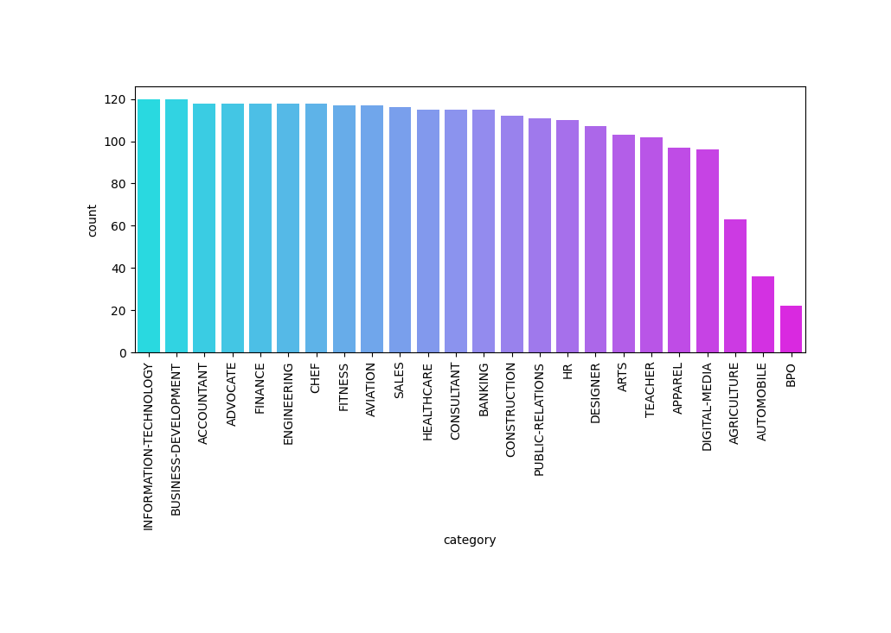
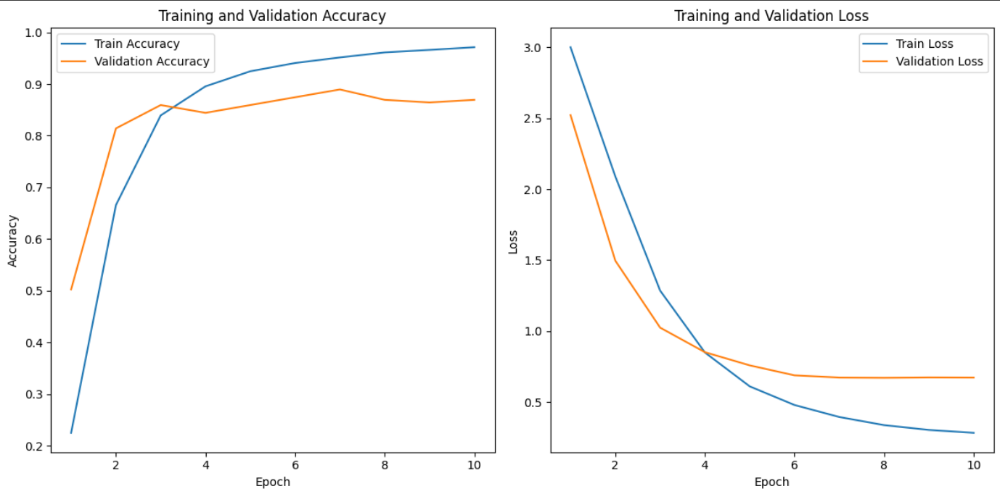

# ResumeSorter
### NLP-Driven Resume Classification pipeline

This project applies Machine Learning and Natural Language Processing to automate the categorization of resumes. The goal is to develop a script that classifies resumes based on their content, streamlining the review process. We employ **DistilBERT** to train on resume data. it is a small and fast Transformer based advance language model with strong contextual understanding. This allows DistilBERT to identify key features for various job categories, offering a more efficient and accurate method for sorting resumes and improving recruitment processes.

 


## Running the Script
To run the Python script follow these steps:

### Step 1: Clone the GitHub Repository 
* Clone the repository to your local machine using Git.
* Open command prompt and run the following command:

```bash
git clone https://github.com/hrafid/ResumeSorter.git

```

### Step 2: Navigate to the Cloned Directory 
```bash
cd ResumeSorter
```

### Step 3: Downloading Additional File
* This script requires an additional file *state_dict_model.pt* to execute.
* Download the file from this [link](https://drive.google.com/file/d/1-OZfY3-VOYt44nThkkuhO5z_QbXs1e4e/view?usp=sharing) and place it in the same directory where the cloned files (*script.py*) are located.
* Afterwards your directory should look something like this:

```bash
ResumeSorter/
│
├── script.py
├── requirements.txt
├── ..............
├── ..............
├── state_dict_model.pt      # Additional file  

```
### Step 4: Set Up a Virtual Environment (Optional)
* Creating a venv with conda and activating it
```bash
conda create -n resumeNlp python==3.8.0
conda activate resumeNlp
```
### Step 5: Install dependencies
* Installing the packages listed in **'requirements.txt'** file
```bash
pip install -r requirements.txt
```

### Step 6: Run the script
*After installing all dependencies and ensuring the additional file is in place, you can execute the script by running the following command:
```bash
python script.py --input_dir "<path/to/pdfs>" 
```
> Replace **'<path/to/pdfs>'** with the folder directory containing the resume pdfs. 

### What to Expect After Running the Script
* The script will read through the resume PDFs and categorize them based on the content of the resumes.
* Category folders within the same directory will be created based on the domain of resume.
* Resumes will be moved into their respective catagory folders

## Rational for selecting DistilBERT
* **Poor Performance of Traditional Models:** Models like Random Forest, SVM, Naive Bayes, Logistic Regression, and K-Nearest Neighbors and others yielded unsatisfactory results in resume categorization. **Accuracy 52-71%**.
* **BERT's Superior Context Understanding:** BERT’s advanced contextual understanding and transfer learning capabilities significantly improved classification accuracy and adapted well to our specific dataset. **Accuracy 77%**
* **Similar Results with RoBERTa:** RoBERTa delivered performance close to BERT, validating our choice of transformer models. **Accuracy 80%**
* **DistilBERT's Accuracy Boost:** DistilBERT enhanced accuracy even further to **Accuracy 83%** while maintaining efficiency in training period leading to lower training time.
* **More Ideal for Small Datasets:** DistilBERT’s fewer parameters and light weight model lead to better generalization on our small dataset, thus reducing chances ofoverfitting. 
* **Fast Predictions:** Its lightweight nature ensures quicker training and prediction contribute to lowering time and space copmlexity, making the model more efficient for practical use.

#
## Developing the Categorization Model

### Dataset
* A resume pdfs dataset [Link](https://drive.google.com/file/d/1gpUMjHtnOGQoiItBYe-q8AUUbdMgzmHK/view?usp=sharing) was utilized in order to train the model
* Class distribution of the dataset:
#


### Cleaning data
* The pdfs are converted into text.
* The texts are stored in pandas dataframe with their category 
Sample dataset after converting to text:

| category | resume    |
| :-------- | :------- |
| ACCOUNTANT | ACCOUNTANT\nSummary\nFinancial Accountant spec... |
| ACCOUNTANT | SENIOR ACCOUNTANT\nExperience\nCompany Name\n ...|
| ACCOUNTANT | ACCOUNTANT\nProfessional Summary\nTo obtain a ..|
| ACCOUNTANT | SENIOR ACCOUNTANT\nProfessional Summary\nSenio...|

* The dataset is cleaned by removing less useful part of text (e.g. emails, numbers)

#

###  Dataset split 
* The dataset is split into three portion: train set, validation set, test set. 
* Ratio for split 70:10:20 

###  Data augmentation
* Easy Data Augmentation (EDA) is applied on train set to address data imbalance issue of some categories.
* After augmentation all category contains 120 samples.

### Data processing for training
* Maping categorical labels to integer values for model compatibility
* Dataset is tokenized with **DistilBertTokenizer**  

### Training model
* Loading a pre-trained DistilBERT model. 
* Set up class weights, optimizer (Adam), loss function (cross-entropy), and learning rate scheduler.
* Training the model over 30 epochs, tracking loss and accuracy.

**Learning curves**
#



* Model was evaluated with a test set of 497 samples.

**Performance on test set**

| evaluation metrics     | score       |
| -----------            | ----------- |
| Accuracy               | 0.83%         |
| Precision              | 0.84%         |
| recall                 | 0.83%         |
| F1                     | 0.83%         |

The model is filetuned and the best model is intregated into the script for resume categorization.
#
## 🔗 Links

[](https://www.linkedin.com/in/rakibul-haque/)


